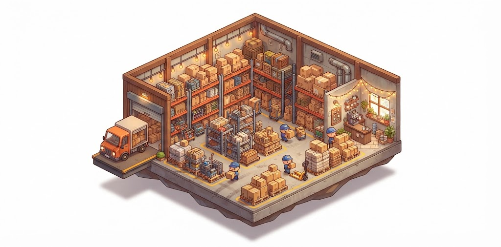
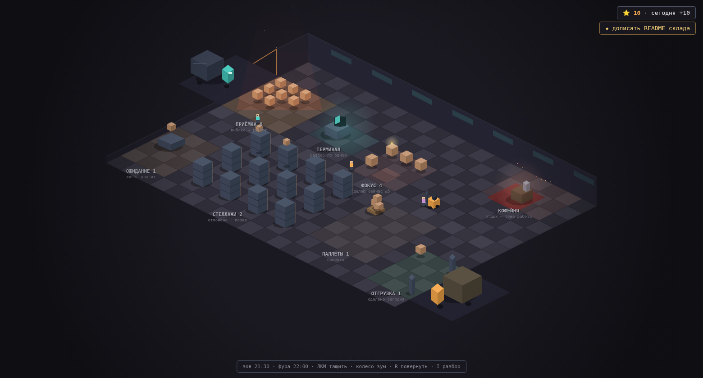
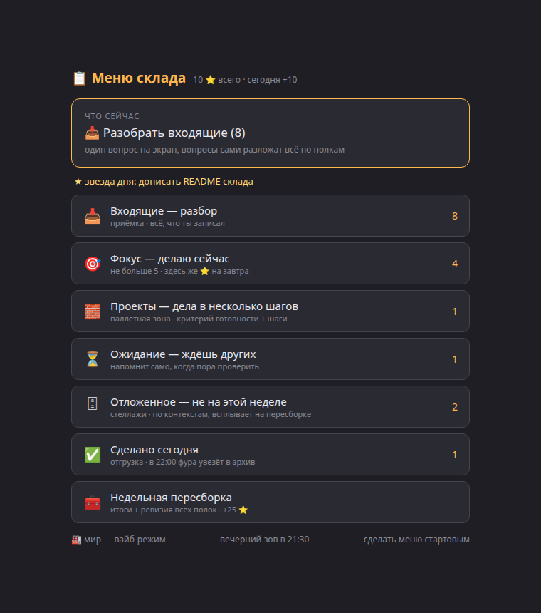
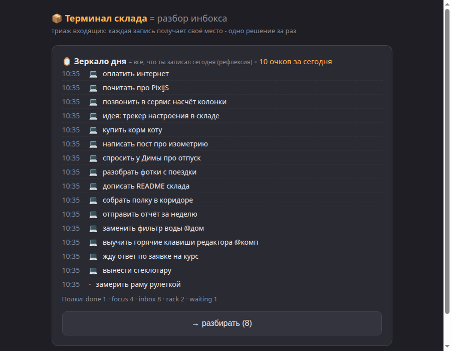
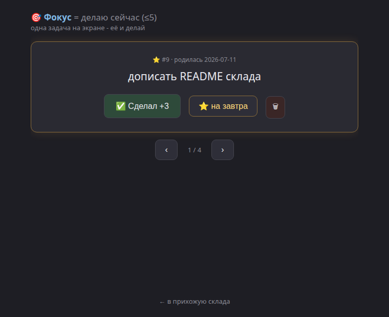

# 📦 Склад — таск-система, в которую хочется возвращаться



Личная продуктивность как изометрический склад: задачи приезжают коробками на приёмку,
разбираются на терминале, едут по полкам и вечером уезжают фурой. Локальный сервер,
SQLite, ноль внешних зависимостей на фронте — canvas 2D без движка.



Два режима на выбор: **мир** (изометрия, атмосфера, прогресс) и **меню** — обычный
списочный интерфейс для работы без раздумий. Сверху меню всегда висит «Что сейчас» —
одно рекомендованное действие: система сама говорит, чем заняться (разбор → ожидание →
пересборка → звезда → фокус). Любой режим можно сделать стартовым.

<p align="center"></p>

## Зачем это

Обычные таск-менеджеры умирают одинаково: в них перестают заходить. Прошлые версии
этой системы умерли именно так. Отсюда метрика №1 — **частота возвращений**, и всё
проектирование крутится вокруг неё:

- **Нулевое трение входа.** Глобальный хоткей → окно на один текст → Enter. С телефона —
  сообщение личному Telegram-боту. Мысль поймана, поток не прерван.
- **Cues вместо мотивации.** Мотивация — 20–30 % поведения и выветривается за месяц.
  Выживание системы держится на сигналах: зов в 21:30, фура в 22:00, баннер недельной
  пересборки. Склад зовёт сам.
- **ПДВ-петля** (Предвкушение → Действие → Вознаграждение): награда видна **до**
  действия — на кнопке написано «✅ Сделал +3», а не просто «готово».
- **Физика мира вместо штрафов.** Не разобрал инбокс к 22:00 — склад встаёт: красное
  аварийное освещение, шлагбаум на воротах, работники замирают. Разобрал — всё поехало.

## Методология

Под капотом — канон, а не геймдизайнерская фантазия:

- **Дэвид Аллен (GTD) + Вотяков (9 списков / ZFG)**: полный набор полок
  (инбокс, фокус, стеллажи, проекты, ожидание, done), триаж-дерево без дырок,
  два столпа — ежедневный разбор и недельная пересборка. Убери один — развал за две недели.
- **Justin Sung**: утром решений ноль (бюджет префронтальной коры). Звезда ⭐ на завтра
  выбирается с вечера, утром склад просто показывает её. Scripted action для худшего дня:
  устал — открой склад на две минуты и отметь одну ⭐.
- **Окрестность внимания**: один объект на экран, скролла не существует. Любой список —
  очередь по одному с счётчиком «осталось N». Максимум 2–3 кнопки; триаж — бинарные
  вопросы конвейерными проходами: один вопрос через всю пачку, один режим мышления за раз.
- **Правило двух языков**: каждый складской термин подписан нормальным языком
  («Паллетная зона = проекты», «Терминал = разбор инбокса»). Метафора — вкус,
  термины — ясность.

## Механики

| Складское | Обычное | Как работает |
|---|---|---|
| 🚛 Приёмка | инбокс | падает всё подряд: хоткей, CLI, Telegram. ~2 % потока — задачи, и это нормально |
| 🖥 Терминал | разбор инбокса | конвейерный триаж: один бинарный вопрос на экран, клавиши 1–6, зеркало дня перед разбором |
| 🎯 Фокус | делаю сейчас | ≤5 задач, по одной на экране, ⭐ на завтра, пыль 🕸 на залежавшихся |
| 🗄 Стеллажи | отложенное | по контекстам (@дом, @комп), листается по одному |
| 🧱 Паллеты | проекты (дела в несколько шагов) | критерий готовности + одношаговые шаги в фокус; серия шагов за день — бонус; месяц без движения — заморозка ❄ |
| ⏳ Ожидание | делегированное | коробка сереет и загорается по таймеру (1-3-7-14 дней); чек в три кнопки |
| 📤 Отгрузка | сделано | витрина дня; в 22:00 фура увозит — accomplishment |
| ☕ Кофейня | отдых | работники отдыхают; клик — пасхалка. Отдых — тоже работа |

Очки: триаж +1, сделано +3, серия паллеты +2, инбокс-в-ноль +10, недельная
пересборка +25. Награда всегда видна заранее.

### Ритуалы

- **21:30 — зов**: «в инбоксе N коробок» → зеркало дня (всё, что записал сегодня) → разбор.
- **22:00 — фура**: увозит done в архив. Не ждёт никого. Инбокс не разобран — стопор.
- **Воскресенье — пересборка**: визард по одному объекту: итоги недели → стеллажи
  («ещё актуально?») → паллеты (шаг в фокус / заморозить) → морозилка. +25.
- **09:30 — утро**: уведомление «⭐ твоя звезда на сегодня» — решение принято ещё вчера.




## Установка

Linux, Python 3.11+, systemd (user), Chrome/Chromium для окна-приложения.

```bash
git clone https://github.com/you/warehouse-game && cd warehouse-game
./deploy/install.sh
```

Скрипт ставит зависимости (`fastapi`, `uvicorn`), user-юнит `warehouse-server`
(порт 8091), симлинк CLI `wh` в `~/bin`. Дальше:

- **Хоткеи** (Настройки → Клавиатура → своя комбинация):
  - захват в инбокс → `capture/capture.sh` (окно на один текст);
  - открыть склад → `capture/open_warehouse.sh` (фокусирует уже открытое окно или
    запускает `chrome --app`).
- **Telegram-вход** (опционально): создай бота у @BotFather, положи токен в
  `~/.config/warehouse/tg_token`, перезапусти `install.sh` — поднимется `warehouse-tg`.
- **CLI**: `wh` — инбокс, `wh add "текст"` — закинуть, `wh all` — счётчики полок.

Настройки — переменные окружения юнита: `WAREHOUSE_PORT` (8091), `WAREHOUSE_DB`
(`~/.local/share/warehouse/warehouse.db`), `WAREHOUSE_CALL` (21:30),
`WAREHOUSE_TRUCK` (22:00), `WAREHOUSE_MORNING` (09:30).

## Архитектура

```
хоткей / wh / Telegram ─→ POST /inbox ─┐
                                       ▼
                    warehouse_server.py :8091  (FastAPI + SQLite)
                    ├── боксы, паллеты, очки, флаги — единственный источник истины
                    ├── планировщик: зов → фура → стопор → заморозка
                    └── отдаёт страницы:
                        /          изометрический мир (canvas 2D, живые данные)
                        /terminal  конвейерный триаж
                        /focus_page /racks_page /pallets_page /done_page /review
```

Мир — не дашборд, а место: работники носят коробки, пылинки висят в луче прожектора,
над зоной с primary action пульсирует свет (он всегда один — канон HIG). Работа с
задачами — чистые панели по клику на зону.

Почему без движка: свежая механика на зрелой технологии (Ёкои). Canvas-примитивы +
дизайн-система от Gemini дали нужный вкус при мгновенной загрузке.

## Философия проекта

Работник склада — это ты на автопилоте (сил мало: один вопрос на экране).
Мыслитель — тоже ты, в режиме рефлексии (сил много: паллеты, пересборка).
Уровень сил заявляешь сам — система не предсказывает.

История решений — в [DESIGN-LOG.md](DESIGN-LOG.md): почему каждая механика такая,
какие умерли и от чего.

## Лицензия

MIT.
